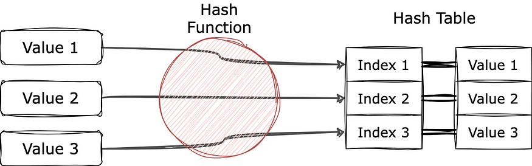

# Hashing & Frequency Counting in Python

This README explains multiple ways to count frequencies of elements in arrays and strings using **dictionaries** and **hashing techniques**.

---



---

## 1. Counting Frequency with Dictionary

```python
arr = [1, 5, 10, 5, 1, 10, 7]
d = {}
for i in arr:
    if i in d:
        d[i] += 1  # If already present, increase by 1
    if i not in d:
        d[i] = 1  # Key created if element not present

for key, value in d.items():
    print(f"{key} is {value}")
```

### Explanation:

* A dictionary `d` is used to store each element as a **key** and its frequency as a **value**.
* If the element already exists, increment its count.
* If not, initialize it with `1`.

✅ Output Example:

```
1 is 2
5 is 2
10 is 2
7 is 1
```

---

## 2. Counting Frequency using Hash Array

```python
arr = [0, 1, 3, 4, 5, 6, 6, 7, 1, 3, 4, 5, 9]
hash_list = [0] * (max(arr) + 1)
for i in arr:
    hash_list[i] += 1

m = [1, 2, 3, 4, 5, 6, 7, 8, 9, 10, 12]
for i in m:
    if i < 0 or i > max(arr):
        print(f"{i} is 0")
    else:
        print(f"{i} is {hash_list[i]}")
```

### Explanation:

* We create a `hash_list` of size `max(arr) + 1`.
* Each index represents a number, and its value is the **count of occurrences**.
* Then, we query frequencies for elements in `m`.

✅ Output Example:

```
1 is 2
2 is 0
3 is 2
4 is 2
5 is 2
6 is 2
7 is 1
8 is 0
9 is 1
10 is 0
12 is 0
```

---

## 3. Frequency Count of Characters in String

```python
s = "abababaacacaqz"
hash_list = [0] * 26
for i in s:
    hash_list[ord(i) - 97] += 1

m = "abcdqzA"
for i in m:
    if i > "z" or i < "a":
        print(f"{i} is 0")
    else:
        print(f"{i} is {hash_list[ord(i) - 97]}")
```

### Explanation:

* `ord(i) - 97` maps characters `'a'` to `'z'` → `0` to `25`.
* Counts frequency of lowercase letters.
* Checks if a query character is lowercase; if not, returns 0.

✅ Output Example:

```
a is 6
b is 2
c is 2
d is 0
q is 2
z is 1
A is 0
```

---

## 4. Highest Occurring Element in an Array

```python
nums = [4, 4, 5, 5, 6]
hash_list = [0] * 100000
for i in nums:
    hash_list[i] += 1

max_frequency = 0
req_index = 9999
for i in range(len(hash_list)):
    if max_frequency < hash_list[i]:
        max_frequency = hash_list[i]
        req_index = i
    elif max_frequency == hash_list[i]:
        if req_index > i:
            req_index = i

print(req_index)
```

### Explanation:

* Builds a `hash_list` where index = element, value = frequency.
* Tracks the **maximum frequency**.
* If two numbers have the same frequency, picks the **smaller number**.

✅ Output:

```
4
```

---

## 5. Find Element with Maximum and Minimum Frequency

```python
arr = [1, 5, 7, 9, 1, 5, 5, 5, 6, 7]
d = {}
for i in arr:
    if i not in d:
        d[i] = 1
    elif i in d:
        d[i] = d[i] + 1

maxcount = 0
maxValue = -1
mincount = 9999
minValue = 9999

for key, count in d.items():
    if maxcount < count:
        maxcount = count
        maxValue = key
    if count < mincount:
        mincount = count
        minValue = key

print(f"maximum Value is {maxValue} , maximum count is {maxcount}")
print(f"minimum Value is {minValue} , minimum count is {mincount}")
```

### Explanation:

* Uses dictionary `d` to store frequencies.
* Tracks both maximum and minimum counts.

✅ Output Example:

```
maximum Value is 5 , maximum count is 4
minimum Value is 9 , minimum count is 1
```

---

# 📌 Key Takeaways

* **Dictionary (`dict`)** → Best for flexible frequency counting.
* **Hash Array (`list`)** → Useful when element range is small & numeric.
* **ord() with strings** → Converts characters into ASCII codes for indexing.
* **Tie-breaking** → Use conditions to handle cases with equal frequencies.

